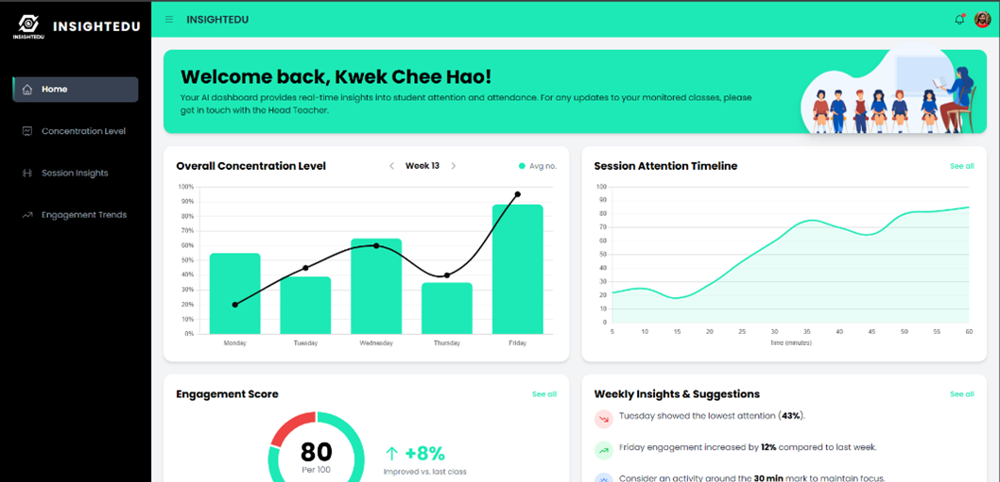
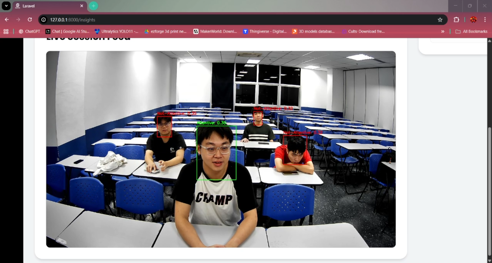
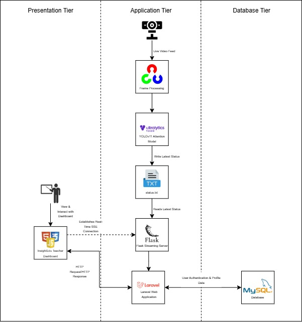

# AI-Powered Classroom Attention Monitoring System (`InsightEdu`)

[](https://www.python.org/)
[](https://laravel.com/)
[](https://opensource.org/licenses/MIT)

A final year project for the **Bachelor of Software Engineering with Honours**, Universiti Tunku Abdul Rahman.

**Author:** Kwek Chee Hao
**Supervisor:** Dr. Mohammad Babrdel Bonab
**Moderator:** Ts. Dr. Sugumaran a/l Nallusamy

---

## 📑 Table of Contents

1. [Project Goal](#1-project-goal)
2. [Key Features](#2-key-features)
3. [Demo & Screenshots](#3-demo--screenshots)
4. [System Architecture](#4-system-architecture)
5. [Technology Stack](#5-technology-stack)
6. [Setup & Installation](#6-setup-and-installation)
7. [How to Run](#7-how-to-run-the-application)
8. [Project Status & Limitations](#8-project-status--limitations)
9. [Future Work](#9-future-work)
10. [License](#10-license)
11. [Acknowledgements](#11-acknowledgements)

---

## 1. Project Goal

Traditional classroom observation is subjective and often fails to provide the real-time, objective feedback teachers need to adapt their methods.

This project, **`InsightEdu`**, addresses the issue by providing teachers with a data-driven, AI-powered platform to monitor and analyze collective student engagement in near real-time — creating a more responsive and effective learning environment.

---

## 2. Key Features

* **Real-time Streaming:** Sub-second latency updates from the AI engine to the teacher dashboard.
* **Collective Attention Monitoring:** Detects up to 30 students per frame, producing a live aggregated attention score.
* **Optimized AI Model:** Powered by **YOLOv8x**, chosen through a comparative study for accuracy in attention detection tasks.
* **Dynamic Teacher Dashboard:**

  * **Session Insights:** Live analysis combining a classroom video feed with an attention timeline.
  * **Prototypes for Future Analytics:** Includes conceptual designs for “Home,” “Concentration Level,” and “Engagement Trends.”

---

## 3. Demo & Screenshots

#### The `InsightEdu` Teacher Dashboard

*(Collage showing the main views of the platform)*


#### The Live AI Engine in Action

*(YOLOv8x model detecting and classifying students in real-time)*


[🎥 Watch Demo Video](videos/demo.mp4)

---

## 4. System Architecture

A **decoupled, dual-backend architecture** ensures responsive user interactions while running continuous AI inference.



1. **AI & Streaming Service (Python):**

   * Captures webcam frames via **OpenCV**.
   * Runs inference using **YOLOv8x**.
   * Streams annotated video + JSON attention data via **Flask**.

2. **Web Application Server (Laravel/PHP):**

   * Handles user-facing features and authentication (MySQL database).
   * Hosts Blade-templated frontend + API endpoints.

3. **Frontend (Blade + JavaScript):**

   * Polls REST API for live updates.
   * Displays interactive dashboards using **Chart.js**.

---

## 5. Technology Stack

* **AI Engine & Streaming:** Python 3.9+, PyTorch, YOLOv8, OpenCV, Flask
* **Backend:** PHP 8.1+, Laravel 10.x, MySQL
* **Frontend:** HTML5, CSS3, JavaScript, Laravel Blade, Chart.js
* **Tools:** VS Code, Git & GitHub, Composer, PIP

---

## 6. Setup and Installation

### Prerequisites

* Git
* PHP >= 8.1 & Composer
* Python >= 3.9 & PIP
* MySQL Server
* Webcam connected to host machine
* *(Optional but recommended: CUDA-enabled GPU for YOLOv8x inference)*

### Instructions

**1. Clone the Repository**

```bash
git clone https://github.com/24-Kwek-44/ai-classroom-monitor.git
cd ai-classroom-monitor
```

**2. Setup Laravel Web Application**

```bash
composer install
cp .env.example .env
```

* Configure `.env` with DB settings.
* Run:

```bash
php artisan key:generate
php artisan migrate
```

**3. Setup Python AI Service**

```bash
cd ai-service
python -m venv venv
# Activate environment
source venv/bin/activate  # macOS/Linux
.\\venv\\Scripts\\activate   # Windows

pip install -r requirements.txt
```

* Place YOLOv8x weights (`yolov8x.pt`) inside `ai-service/`.

---

## 7. How to Run the Application

Run **two services** in parallel:

**Terminal 1 – Laravel Web Server**

```bash
php artisan serve
```

> App available at: `http://127.0.0.1:8000`

**Terminal 2 – Python AI & Streaming Service**

```bash
cd ai-service
python webcam_app.py
```

> Streaming server: `http://127.0.0.1:5001`

Now open the web app → register → navigate to **Session Insights** for live feed + attention metrics.

---

## 8. Project Status & Limitations

✅ Implemented & Functional:

* User authentication
* Real-time AI attention classification
* Live data + video streaming
* “Session Insights” dashboard

🛠 Prototypes Only (UI not yet linked to backend):

* “Home,” “Concentration Level,” “Engagement Trends”

⚠️ Current Limitations:

* No long-term session data persistence
* Collective-only analysis (no per-student tracking yet)

---

## 9. Future Work

* Full database integration for session history
* Multi-student tracking (e.g., **DeepSORT**)
* Correlation with academic performance metrics

---

## 10. License

This project is licensed under the [MIT License](LICENSE).

---

## 11. Acknowledgements

* Supervisors & moderators for guidance
* Open-source tools: Ultralytics YOLO, Flask, Laravel, Chart.js
* Universiti Tunku Abdul Rahman for research support

---
